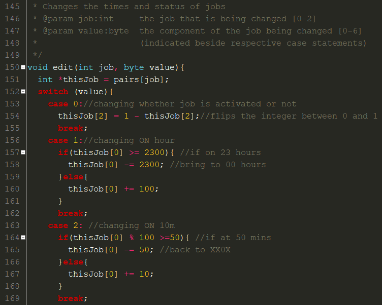
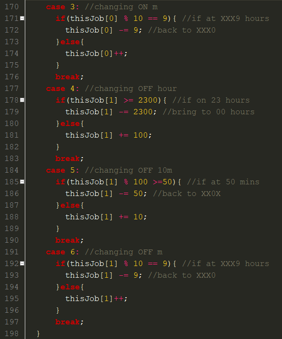

<body>
    

        <h1 class="display-1">Computer Science Coursework Report</h1>
        <!--Contents links-->
        

            <a href="#IandP">
                <h3>Investigation and plan</h3>
            </a>
            <a href="#Design">
                <h3>Design</h3>
            </a>
            <a href="#IandT">
                <h3>Implementation and Testing</h3>
            </a>
            <a href="#Evaluation">
                <h3>Evaluation</h3>
            </a>
            <a href="#references">
                <h3>References</h3>
            </a>
            <a href="#Words">
                <h3>Summary Word Count</h3>
            </a>
        <h1 id="IandP" class="display-3">Investigation and plan</h1>
        <a href="#"><small>Back to top</small></a>
        

            The smart home industry is a culmination of different uses of technology in a domestic setting. This industry produces solutions to automate household tasks, provide better security to users, and assist the disabled and elderly.  The industry has a wide range of economic and social implications and incorporates novel technologies such as the Internet of Things (IoT). Generally speaking, smart home devices constitute a device which runs embedded software which could carry out a multitude of functions.  They vary widely in cost, complexity and use cases.
        

        

            In order to create a system that conforms firstly with the basic requirements of the brief, I can use an arduino to control any kind of appliance or system, like a burglar alarm, timed coffee machine, etc.. Principally, the device must operate independently or with minimal user input after being set up in order to meet the requirements.
        

        

            My envisaged system is a smart plug/timer which, while not complex in standalone functionality, can be used for almost any application, and in a variety of use cases.  This makes it extremely versatile and allows its functionality to change as the user decides. The embedded device will be made using an arduino to act as a microcontroller to flip a relay in the plug. I can use a DS1307 real time clock (RTC) for timekeeping.  This time will be read by the microcontroller to determine whether the relay should be on, and this will be displayed to the user using the lcd. 
        

        

            Existing smart plug solutions I found during research are purely remote-controlled.  While this makes sense in the majority of cases, it requires that the end user has wifi in all corners of their home and does not want to set up the system on its own.  This will make my smart plug more suitable for general use cases as it does not require connectivity, external (usually proprietary) software or remote control for basic functionality.
        

        <h3>System Requirements</h3>
        <table class="table">
            <tr>
                <td>Level</td>
                <td>Embedded System</td>
                <td>Website (pages)</td>
            </tr>
            <tr>
                <td>Basic</td>
                <td>
                    <ul>
                        <li>Timekeeping functionality</li>
                        <li>Acceptance of user input</li>
                        <li>Display output (Liquid Crystal Display)</li>
                        <li>Relay control</li>
                    </ul>
                </td>
                <td>
                    <ul>
                        <li>Welcome/landing</li>
                        <li>Product(s)</li>
                        <li>About us</li>
                        <li>Mission Statement</li>
                    </ul>
                </td>
            </tr>
            <tr>
                <td>Advanced</td>
                <td><ul><li>Acceptance of Serial Communication</li></ul></td>
                <td>
                    <ul>
                        <li>Login/register</li>
                        <li>Dashboard to control device, strict input validation</li>
                    </ul>
                </td>
            </tr>
        </table>
        

            In order for the device to function with a positive social impact and conform with universal design principles, considerations must be made into accessibility, potentially by allowing for adaptation for certain users if necessary.  Furthermore, the nature of the device already lends itself to a positive social impact as it can be used to cut off power to appliances that consume power on “standby mode,” leading to decreased domestic consumption and a positive effect on the environment.
        

        

            To implement the website, I will use Laravel. This is a PHP Model-View-Controller (MVC) Framework. This means that it separates the functionality of a web based application into distinct parts.  This allows for faster development, tighter security, less code repetition (using components) and much greater extensibility.
        

        <h3>Iterative Design</h3>
        

            In order to apply an iterative approach to my design and implementation of this project, my workflow will look something like this:
        

        
(4)

        

            This is the iterative design process provided in my textbook and the text underneath outlines which sections of the report cover the respective stages in the process.  Each time a new feature is added, I iterate back to plan in order to figure out what the next one will be.  Details are ironed out in the design phase, implemented in the create phase, and testing (with necessary modification), etc. is done in the evaluation phase.  The cycle is then repeated.  
        

        <h1 id="Design" class="display-3">Design</h1>
        <a href="#"><small>Back to top</small></a>
        <h3>Embedded System</h3>
        

            Below is the high-level system architecture for the smart plug.
        

        

        

            In order to meet the needs of the envisaged end user, it must be possible to alter the behaviour of the device very easily. This means that a simple user interface must be implemented to ensure ease of use.  After multiple failed attempts at a simple input & menu system, here is the final design:
        

        

        

            Where the underlined figures on the job changing screen are possible cursor locations.  For the purposes of this project, I’ve set up 3 jobs.  Translating user input into changes in system variables proved challenging, but after I had written it out on paper it became clear how to implement it.  I modelled the “MODE” behaviour to be analogous to heating timers, flattening the learning curve slightly.  The system can be in either “ON”, “OFF” or “TIMED” mode.
        

        

            When in timed mode, the system must continuously check to see if it is scheduled to be on.  Therefore, the simple loop below will act at the core of the embedded software:
        

        

        

            This flowchart does not describe an algorithm as there is no guarantee of termination, therefore not conforming to Donald Knuth’s definition of an algorithm, which requires <i>Finiteness</i>. (2)
        

        <h3>Website</h3>
        

            Implementation of the website will be less time consuming than the embedded system, but it is important to make universal design considerations to ensure the user interface is accessible to anyone.  As such, contrast is an important consideration in text formatting, to allow users with sight impairments to be able to use the website like any other user.  
        

        

            Regions of the pages must be well defined and it is imperative that all information is clearly presented to the envisaged end user. This serves the interests of the owner of this fictional home automation company by allowing them to convey aspects of their company to prospective customers.
        

        

            Navigation is an essential part of any web application.  In order to make this as seamless as possible, a horizontal navbar will be placed at the top of each screen and indicate which page the user is currently viewing.
        
   
        

            As a home automation company would require a backend to interact with databases, external APIs, etc.. Incorporating a framework like Laravel is in line with the needs of the envisaged owner of the fictitious business and would greatly benefit their customers, our envisaged end user. Laravel includes a templating engine called Blade which almost nullifies code repetition by allowing the same markup to be used across different pages with components.  This will come in handy when I implement my navigation system. Below is a diagram of how a MVC application is laid out (1).
        

        

        <h3>Remote Control</h3>
        
This aspect of design was carried out after the implementation of the above mentioned design goals, in accordance with iterative development.  It was necessary to establish basic functionality before progressing to more complicated operations.  Using a server-side scripting language (PHP) became extremely useful in coordinating the operation of the embedded system from the website.

        
After many unsuccessful attempts, the below path for data transmission between the locally hosted Laravel application and the arduino was established:

        

 
        <h3>Design Timeline</h3>
        <ul>
            <li>Decision on overall project idea: smart plug</li>
            <li>Component needs decided on</li>
            <li>Outline of input & output system</li>
            <li>Button functionality details solidified</li>
            <li>Mode functionality design</li>
            <li>Decision on how to store times</li>
            <li>Stored as 4-digit integer, implications when modifying ON/OFF times</li>
            <li>Decision to limit to three (ON/OFF) “Jobs” for simplicity</li>
            <li>Menu system designed</li>
            <li>Design of job times modification using switch statement</li>
            <li>Design of website UI, navigation system</li>
            <li>Dashboard designed</li>
            <li>Remote control data path finalised</li>
            <li>Acceptance of communication and “REMOTE CONTROL” behaviour of embedded system outlined</li>
        </ul>
        <h1 id="IandT" class="display-3">Implementation and testing</h1>
        <a href="#"><small>Back to top</small></a>
        
In order to achieve the basic system architecture laid out under the design heading, I assembled the embedded system to the following wiring schematic:

        

        <h3>Timekeeping and basic display functionality</h3>
        

            This implementation required extensive use of modular programming concepts.  To allow communication between the arduino and the RTC, I used a library. This behaves effectively as a device driver for the RTC.  
        

        

            At compile time, the system time from my computer is written to the RTC.  Working with dates and time is notoriously difficult with computers due to their irregular patterns, etc.  Thankfully, there was an appropriate structure incorporated in the library, which allowed me to access the components of the time in a more developer-friendly way, e.g. time.Day() can return the current day of the month.  
        

        

            In order to communicate with the lcd, it was also necessary to use a library.  It allows me to set the cursor and print to the lcd as if it were a console on a computer, which made displaying information very straightforward.  Following the examples given by these libraries, I created a program to output the date and time from the RTC to the lcd.  
        

        

        <h3>Modes</h3>
        
This is the default screen as described in the design phase:

        

        

            The mode (“ON”, “OFF”, “TIMED”) of the system is cycled using a button.
        

        <h3>Timer Functionality</h3>
        

            When I first set out to develop this behaviour, I hard-coded one “pair” of on/off times.  Once the comparison logic for this was up and running, I made a multi-dimensional array of these times called “pairs” and looped the comparison through that.
        

        <table class="table">
            <tr>
                <td>Job no.</td>
                <td>ON time</td>
                <td>OFF time</td>
                <td>Activated</td>
            </tr>
            <tr>
                <td>1</td>
                <td>1530</td>
                <td>1745</td>
                <td>1</td>
            </tr>
            <tr>
                <td>2</td>
                <td>1215</td>
                <td>1330</td>
                <td>0</td>
            </tr>
            <tr>
                <td>X</td>
                <td>XXXX</td>
                <td>XXXX</td>
                <td>0/1</td>
            </tr>
        </table>
        

            I had planned to use arrays to store time in different components (hours, mins) and use it for comparison, but found that it would add unnecessary complexity to the comparison logic for the TIMED mode. After I noticed this, I decided to store on/off times as integers, and convert system time to the same format in order to compare them and decide whether the relay should be on at that time.  
        

        

            Below is how the time pairs are stored. These are default values for testing.
        

        

        

            At runtime, the loop() of the arduino’s software is called repeatedly, and this code block is included which checks to see if the current time is between the on and off times for an active job, and if it is, outputs that to the relay. 
        

        

         
        

            I had run into problems on line 430.  That statement initially evaluated whether RTC.get() == previousTime+1. This didn’t work as more than one second elapsed between previousTime being initiated and this comparison being made for the first time.  The solution was very simple but because I did not get any compiler errors it was difficult to spot this bug.
        

        <h3>User Input</h3>
        

            Below is the code which manages changing variables according to user input:
        

        

            

                
            

            

                
            

        

        

            A learning opportunity was presented to me on line 150. In order to avoid repeating “pairs[job]” in almost every line of the switch, I assigned this to a new variable named thisJob.  Unlike in python, this would not work unless I assigned the variable as a pointer.  I was totally unfamiliar with this concept and this line was the most time consuming out of the whole above code.
        

        

            This, like the rest of the embedded software, was commented very liberally as it made the development less confusing and allows others to understand what is going on in the code.  All functions have their job, parameter(s) and return value(s) commented at their definition. Using a switch statement like this one as opposed to a string of if/else statements hugely improves readability.
        

        <h3>Overall Embedded Software</h3>
        

            Here is an overview of different modules within the embedded system software:
        

        

        

            Where red-boxed components are built in functions for the arduino system.
        

        

            During testing of the system, I found that the relay would not update properly on mode changes depending on what the screen was displaying.  This was a result of a logical error I had made in implementing screen behaviour.  To rectify this, I decomposed the toggle() function and removed the part of it that wrote the current status to the relay.  This became writeRelay(), and could be called without changing the mode.
        

        

            show4digits() involved a lot of repetition of show2digits() code, so it was modified to call show2digits twice within itself
        

        <h3>Website</h3>
        

            Using Laravel for the backend and Bootstrap for the frontend massively increased my productivity and led to a seamless development process.  For example, Laravel abstracts administration and communication with relational databases using “migrations” and “models” (3). Below are screenshots of the various pages within the website:
        

        

        

        

        

        

        

        

        

        

        

            During development of the website, I constantly stopped to test it and traverse through it in order to check that everything was working properly.  This led to the discovery of small problems that would have gone unnoticed otherwise, e.g. broken links, incorrect location highlighting in the navbar.  These were addressed before moving forward. 
        

        <h3>Advanced Requirements</h3>
        

            Testing initial communication involving setting jobs using JSON proved unnecessarily complicated, and I think I was overly ambitious to try and deal with so much data over serial. I shaved back the design of this as if the device is connected, external software can do all the timing and control, and all the embedded system needs to do is accept external communication and act accordingly.
        

        

            As laid out under the design heading, the website can direct user input from the website to the embedded system. Using the dashboard page, the user can turn the switch on or off:
        

        

        

            In order to send a http GET request to the SerialController, javascript attempts to load an image from the corresponding route:
        

        

        

            This is passed to the controller through the route, with validation checks:
        

        

        

            The controller calls a python script through the shell with a command line argument (0/1)
        

        

        

            This python script sends the data over serial
        

        

        
And the arduino receives it and changes behaviour accordingly

        

        <h1 id="Evaluation" class="display-3">Evaluation</h1>
        <a href="#"><small>Back to top</small></a>
        <h3>Reflection</h3>
        

            Overall, I was satisfied with how my coursework project turned out.  Based on my initial design goals, I managed to incorporate the real-time clock, control the relay, display output to the user on the lcd, and take user input from the buttons.  In accordance with the brief, the system acts purely autonomously after the user sets it up.  Furthermore, it takes instructions over serial which affect its behaviour.  These can be provided by the website, therefore achieving the advanced requirements as set out by the brief.
        

        

            As well as the design ambition, the needs of the end user are met fully by the proper operation of the device, intuitive control interface, clear output, and ability to control the device remotely from the website.  
        

        <h3>Future developments/possible modifications</h3>
        

            The limited computing resources of my chosen hardware proved to be a limiting factor in  implementation.  The Arduino Uno which I had used only comes with 32KB of flash memory (storage) and 2048 bytes of dynamic memory.  Using something like the Arduino Mega 2650 would allow for much more extensive embedded software.
        

        

            To further my completion of the project, I would have purchased a current measuring device and incorporated it into my embedded system.  This would send information to the end user, which could be processed to yield reports and suggestions on how to reduce power consumption.  This would further the social impact of the device by encouraging people to use less power and informing them of the environmental impact of domestic appliances.  
        

        <h3>Other applications</h3>
        

            Due to the generality of the device, it could be incorporated into any other home automation system to behave in a similar manner.  For example, it could be included in a lighting system to illuminate an area at certain times of the day.
        

        <h1 id="references" class="display-1">References</h1>
        <a href="#"><small>Back to top</small></a>
        <h3>Report</h3>
        
Bootstrap: <a href="https://getbootstrap.com/">https://getbootstrap.com/</a>

        <ol>
            <li><a href="https://medium.com/@joespinelli_6190/mvc-model-view-controller-ef878e2fd6f5">MVC Overview</a></li>
            <li><a href="https://seriouscomputerist.atariverse.com/media/pdf/book/Art%20of%20Computer%20Programming%20-%20Volume%201%20(Fundamental%20Algorithms).pdf">The Art of Computer Programming</a></li>
            <li><a href="https://laravel.com/docs/9.x/database">Laravel (Database)</a></li>
            <li><a href="https://www.bookhaven.ie/school-books/9781999829315-computer-science-for-leaving-cert.html">Computer Science for Leaving Certificate</a></li>
        </ol>
        <h3>Website</h3>
        
Laravel <a href="https://laravel.com/">https://laravel.com/</a>
 
        
In the root directory of the website (Artefact/ClisTeach) there is Composer.lock and package-lock.json.  These are automatically generated and clearly outline and credit dependencies of the application.

        <h3>Embedded System</h3>
        
Arduino <a href="https://www.arduino.cc/">https://www.arduino.cc/</a>

        <ul>
            <li>LCD library: <a href="https://www.arduino.cc/en/Reference/LiquidCrystal">https://www.arduino.cc/en/Reference/LiquidCrystal</a></li>
            <li>Time library: <a href="https://playground.arduino.cc/Code/Time/">https://playground.arduino.cc/Code/Time/</a></li>
            <li>RTC library: <a href="https://www.arduino.cc/reference/en/libraries/ds1307rtc/">https://www.arduino.cc/reference/en/libraries/ds1307rtc/</a></li>
            <li>Button control library: <a href="https://www.arduino.cc/reference/en/libraries/ezbutton/">https://www.arduino.cc/reference/en/libraries/ezbutton/</a></li>
        </ul>
        <h1 id="Words" class="display-3">
            Summary Word Count
        </h1>
        <a href="#"><small>Back to top</small></a>
        

            <table class="table">
                <tr>
                    <td><u>Section</u></td>
                    <td><u>Word Count</u></td>
                </tr>
                <tr>
                    <td>Investigation and Plan</td>
                    <td>592</td>
                </tr>
                <tr>
                    <td>Design</td>
                    <td>606</td>
                </tr>
                <tr>
                    <td>Implementation and Testing</td>
                    <td>1006</td>
                </tr>
                <tr>
                    <td>Evaluation</td>
                    <td>296</td>
                </tr>
                <tr>
                    <td>Total</td>
                    <td>2500</td>
                </tr>
            </table>
        

    

</body>
</html>
